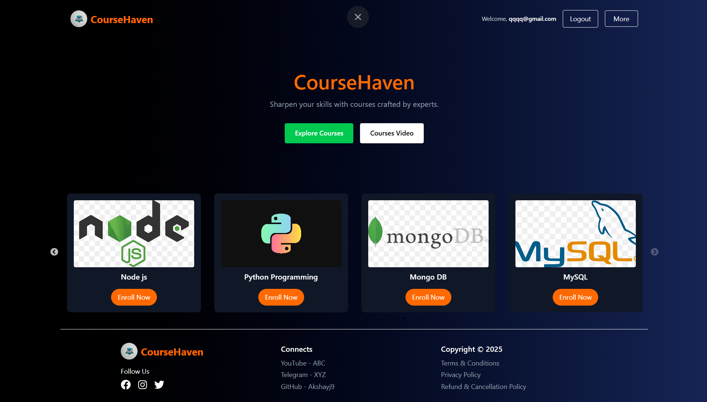
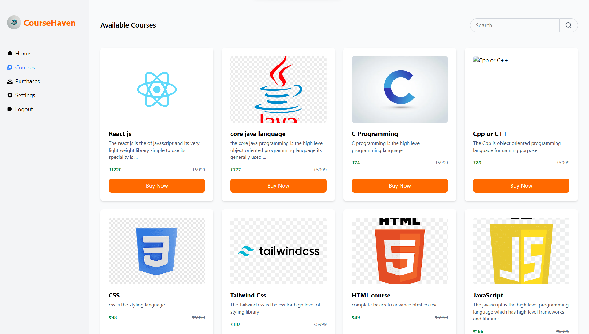
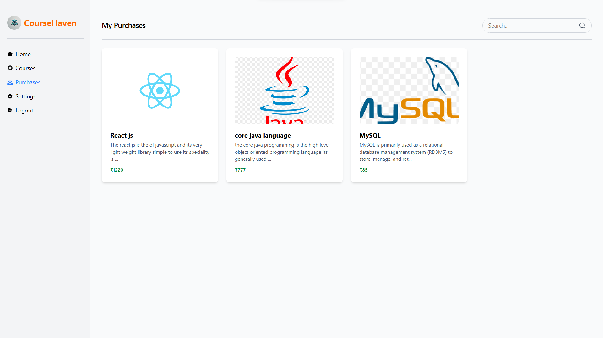
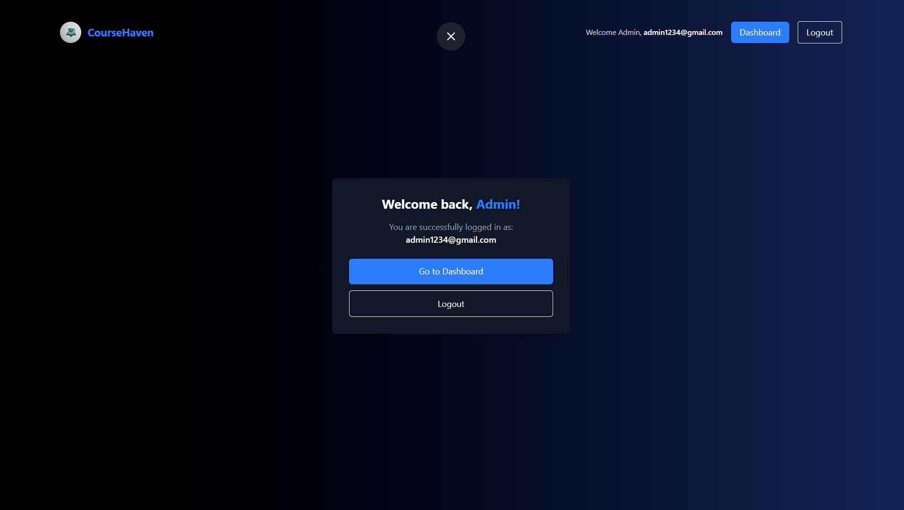
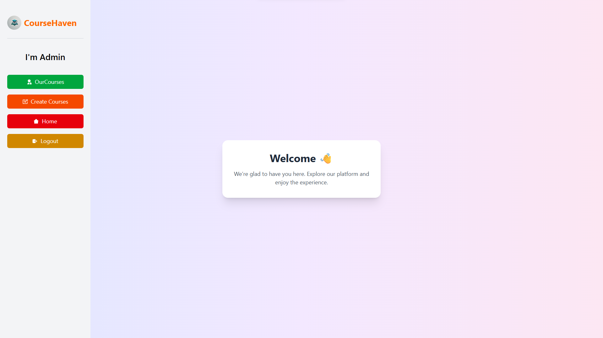
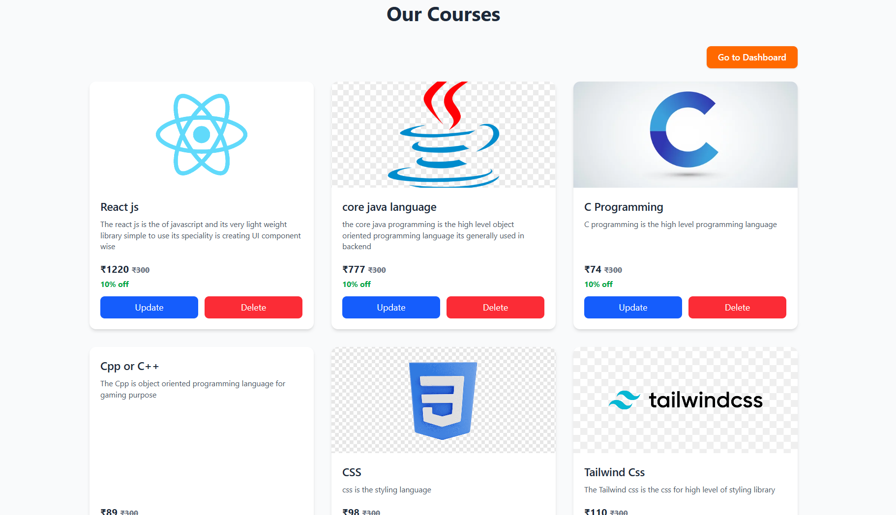
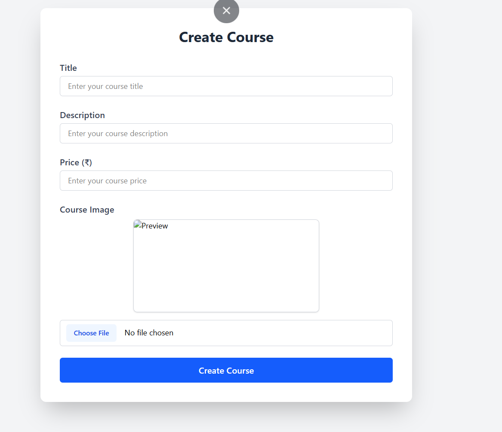

# 🛒 E-commerce Course Selling App (MERN Stack)

A full-stack web application that allows users to browse and purchase online courses. Built with the **MERN stack** (MongoDB, Express.js, React.js, Node.js), this platform supports secure authentication, course exploration, Stripe payment integration, and a personalized purchase dashboard.

---

## 🚀 Features

### 🧑‍💻 User
- Sign up / Log in with JWT-based authentication
- Browse a list of available courses
- View course details (title, description, thumbnail, price)
- Purchase courses securely via Stripe
- View purchased courses in “My Purchases”

### 👨‍🏫 Admin
- Add new courses with images, description & price
- Manage course catalog (CRUD operations)

### 💳 Stripe Integration
- Secure checkout using Stripe
- Real-time purchase confirmation
- Stores orders in the database upon success

---

## 🛠️ Tech Stack

| Frontend                      | Backend           | Database | Payment    |
|------------------------------|-------------------|----------|------------|
| React.js, Vite, Tailwind CSS | Node.js, Express  | MongoDB  | Stripe API |

---

## 📁 Project Structure

<pre>
mern-course-app/
├── backend/
│   ├── controllers/       # Route handlers for business logic
│   ├── models/            # Mongoose schemas and models
│   ├── routes/            # API route definitions
│   ├── middleware/        # Custom middlewares (e.g., auth)
│   ├── config.js          # Configuration file (Stripe, JWT, etc.)
│   └── index.js           # Entry point for the Express server
├── frontend/
│   ├── components/        # Reusable React components
│   ├── pages/             # Route-based React components/pages
│   ├── utils/             # Helper functions (API, formatting)
│   └── main.jsx           # React app entry point
├── .env                   # Environment variables (not committed to Git)
├── .gitignore             # Files and directories to ignore in Git
└── README.md              # Project documentation
</pre>

---

## 🔗 Live Demo

🌐 **Live Site**: [https://your-deployed-site-url.com](https://your-deployed-site-url.com)

---

## 📸 Project Demo

> _Replace the image URLs below with your actual screenshots hosted on GitHub, Imgur, or any CDN._

| Home Page | Course Detail | My Purchases |
|----------|---------------|---------------|
|  |  |  |  |  |   |  

---

## ⚙️ Setup Instructions

### Clone the repository

```bash
git clone https://github.com/AkshayJ9/E-commerce-Course-App.git
cd E-commerce-Course-App
```

## 👤 Author

**Akshay Jadhav**  
📧 Email: akshayj.contact@gmail.com
📱 Phone: +91-7249471395  
🔗 GitHub: [@akshayj9](https://github.com/akshayj9)
🔗 LinkedIn: [Akshay Jadhav](https://linkedin.com/in/akshaykjadhav)
